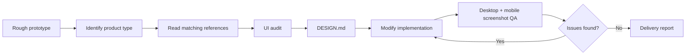

# Codex UI Designer Kit

Codex UI Designer Kit helps Codex turn rough but working prototypes into product-grade UI.

It is built from public UI samples, structured design references, practical checklists, a reusable Codex skill, templates, screenshot QA scripts, and a verified before/after example.

## Problem

Codex can quickly build tools, dashboards, demos, and internal apps, but the first version often looks like a functional prototype:

- unclear hierarchy,
- weak navigation,
- oversized hero sections for tools,
- inconsistent cards/tables/forms,
- missing loading/empty/error/disabled states,
- broken mobile layout,
- no screenshot QA,
- no risk controls for customer data or external actions.

This kit turns those recurring problems into a repeatable workflow.

## Suitable Scenarios

- SaaS dashboards and admin tools.
- CRM, customer operations, WeCom/企微 workflows, support or sales tools.
- AI workbenches, prompt tools, agent UIs.
- Data dashboards and BI-style reports.
- H5/mobile forms, reports, campaigns, and lightweight tools.
- Mini-program-style list/detail/submit workflows.
- App-style Web UIs with feeds, cards, and persistent navigation.

## Not Suitable For

- Copying another company's brand assets or proprietary design.
- Capturing private dashboards, logged-in pages, customer data, or secrets.
- Replacing product thinking with visual decoration only.
- High-risk customer messaging, exports, writebacks, or permission changes without human review.

## Workflow



## Project Structure

```text
.
  AGENTS.md
  SKILL.md
  README.md
  checklists/
  examples/
  references/
  samples/
  scripts/
  templates/
```

## Quick Start

1. Read the skill workflow:

   ```powershell
   Get-Content -Encoding utf8 -Raw .\SKILL.md
   ```

2. Pick the closest UI type from `references/`.

3. Audit the rough prototype with:

   - `templates/UI_AUDIT.md`
   - `checklists/ui-audit-checklist.md`
   - `checklists/product-ui-risk-checklist.md`

4. Write a design plan with:

   - `templates/DESIGN.md`

5. Modify the app.

6. Run screenshot QA:

   ```powershell
   node .\scripts\visual-audit.mjs --url http://localhost:3000 --name after
   ```

   Or for a static file:

   ```powershell
   node .\scripts\visual-audit.mjs --file .\examples\ugly-saas-dashboard\improved.html --name after --out .\examples\ugly-saas-dashboard\.design
   ```

7. Generate before/after and delivery reports when applicable:

   ```powershell
   node .\scripts\compare-before-after.mjs --out .\examples\ugly-saas-dashboard\.design
   node .\scripts\generate-ui-report.mjs --caseDir .\examples\ugly-saas-dashboard
   ```

## How To Connect This Kit To Another Codex Project

Copy or reference these files in the target project:

- `AGENTS.md`
- `SKILL.md`
- `references/`
- `checklists/`
- `templates/`
- `scripts/visual-audit.mjs`

Recommended target-project workflow:

1. Start the target app locally.
2. Ask Codex to use this kit.
3. Codex identifies the product type.
4. Codex reads the matching `references/*.md`.
5. Codex writes `UI_AUDIT.md` and `DESIGN.md`.
6. Codex edits the UI implementation.
7. Codex runs screenshot QA.
8. Codex fixes QA findings and writes `UI_DELIVERY_REPORT.md`.

## Running Screenshot QA

`scripts/visual-audit.mjs` is the MVP QA tool.

It checks:

- blank/loading-page risk,
- horizontal scroll,
- text overflow candidates,
- small button candidates,
- large fixed overlay candidates,
- desktop and mobile screenshots.

Output:

```text
.design/
  screenshots/
    after-desktop.png
    after-mobile.png
  UI_QA_REPORT.md
  after-qa.json
```

The tool uses a temporary Chrome profile. It does not read your logged-in browser profile.

## Example

See `examples/ugly-saas-dashboard/`.

It includes:

- `original.html` - rough prototype.
- `.design/screenshots/before-desktop.png`
- `.design/screenshots/before-mobile.png`
- `UI_AUDIT.md`
- `DESIGN.md`
- `improved.html` - improved product UI.
- `.design/screenshots/after-desktop.png`
- `.design/screenshots/after-mobile.png`
- `.design/UI_QA_REPORT.md`
- `.design/BEFORE_AFTER_REPORT.md`
- `BEFORE_AFTER.md`
- `UI_DELIVERY_REPORT.md`

The after version improves layout, information architecture, KPI clarity, table scanability, state coverage, risk controls, and mobile responsiveness.

## Data Safety And Human Review

This kit is optimistic about automation, but not blind.

Human review is required for:

- customer data display, export, or writeback,
- WeCom/企微, email, SMS, webhook, or bulk-send actions,
- permission changes and public sharing,
- deleting, merging, or batch-modifying records,
- API keys, tokens, secrets, internal links,
- external-facing copy, dates, links, recipients, and downloadable files.

When in doubt, stop before the external side effect and ask for confirmation.

## Current Status

- Stage 1 sample library: complete.
- Stage 2 structured references: complete.
- Stage 3 checklists: complete.
- Stage 4 Codex skill: complete.
- Stage 5 onboarding templates and AGENTS instructions: complete.
- Stage 6 visual QA MVP scripts: complete.
- Stage 7 before/after example: complete.

## Future Enhancements

- Add interactive state capture for hover, selected, modal, empty, error, and disabled states.
- Add component-level visual diff.
- Add framework-specific adapters for Next.js, Vite, React, Vue, and Svelte.
- Add richer accessibility checks.
- Add more verified examples for AI workbench, CRM, and mobile form flows.

