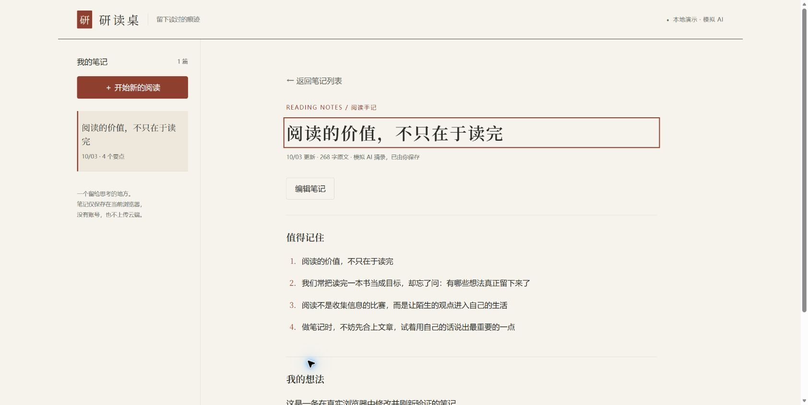
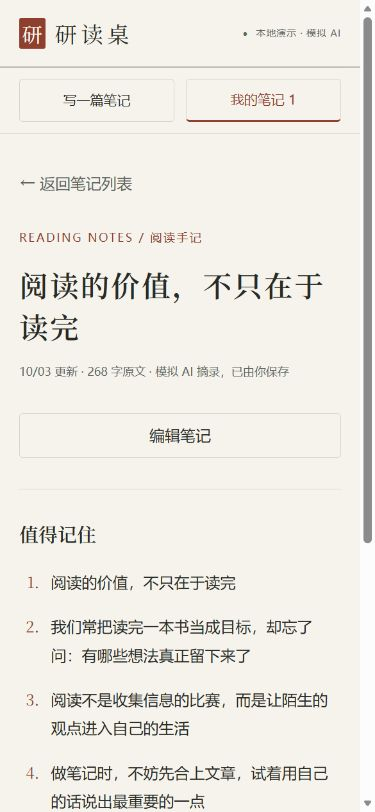
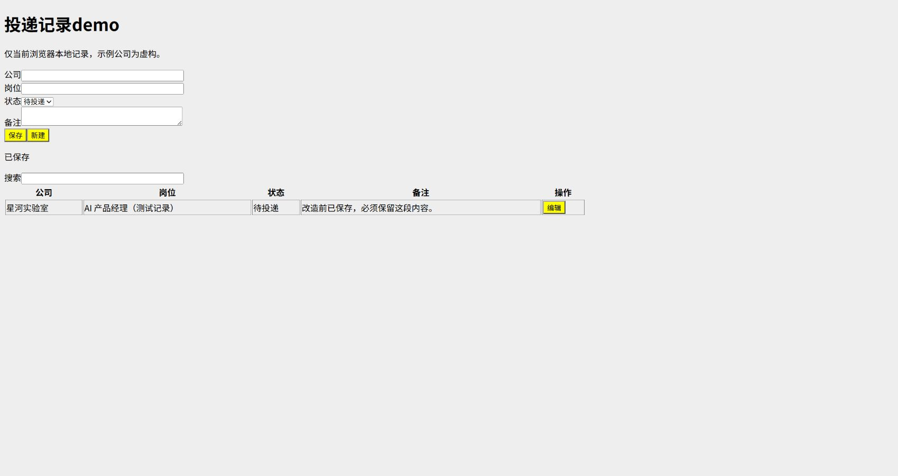
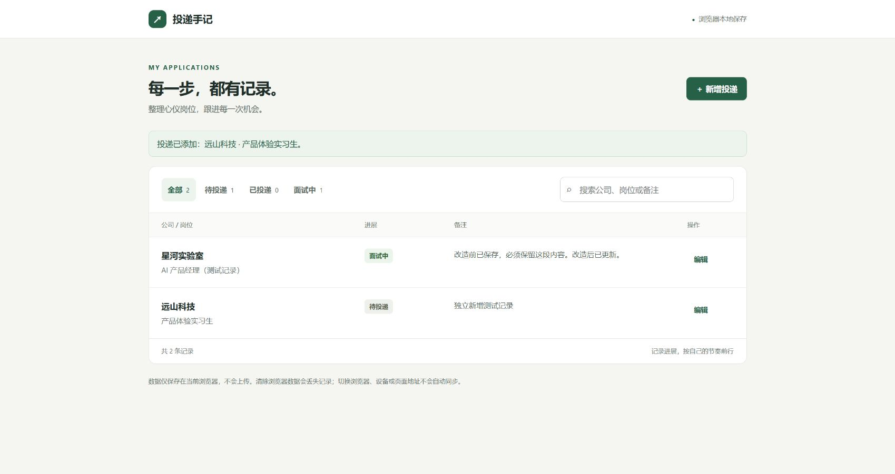
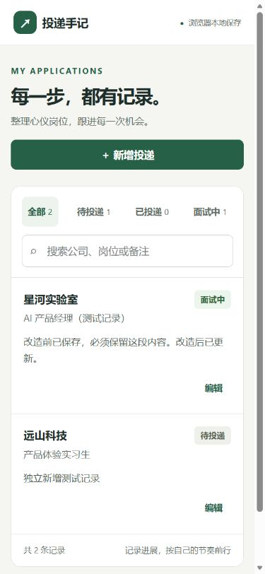

# Codex UI Designer Kit

### 说清楚你想做什么，设计判断交给 Skill。

让没有设计经验的人，通过 Codex 把产品想法或粗糙 demo 做成一套清楚、一致、可操作的页面。

你不用先懂字体搭配、栅格、骨架屏或转场术语。描述用户、任务与想要的感觉，Kit 会引导 Codex 规划页面、选择视觉方向、实现交互，再通过真实页面检查迭代。

[看案例](#三个案例) · [开始使用](#开始使用) · [Skill入口](SKILL.md) · [验证记录](docs/showcase-validation.md)



> **当前阶段：候选版本。** 已有本地可运行案例与指定浏览器验证；“产品级”是设计和验收目标。案例 AI 为本地模拟，真人审美仍待验证。

## 它能帮你做什么

| 你现在的情况 | 交给 Kit 的输入 | Codex 应交付什么 |
|---|---|---|
| 只有一个产品想法 | 谁用、要完成什么、想要什么感觉 | 必要页面、统一视觉规范、可运行主流程 |
| 已经有一个小 demo | 现有代码或运行入口、哪里不好用 | 保留原行为与数据的改造，以及前后对比 |
| 只想调整一个区域 | 指定页面或组件、期望变化 | 沿用现有设计系统的局部优化 |
| 说不出效果的名字 | “生成时别空着”“详情别突然跳出来” | 白话解释、适合的方案，必要时提供比较样例 |

它把**设计判断、代码实现、真实验收**串在一起。已有组件和技术栈优先复用，不强制迁移到特定前端框架。

## 三个案例

### 01 · 研读桌：从想法到阅读产品

> “我没有设计经验，希望像一本安静的杂志。粘贴文章后整理要点，能保存、查看和编辑；电脑手机都能用。”

- **设计判断**：用纸白、墨色与朱红建立阅读气质；桌面目录与正文双栏，手机聚焦单个任务。
- **实际流程**：粘贴 → 模拟整理 → 校订 → 保存 → 列表 → 详情 → 编辑。
- **交互细节**：等待反馈、取消、原文保留、刷新读回、轻转场及减少动态效果。

<table>
<tr><td width="72%"></td><td width="28%"></td></tr>
<tr><td>桌面：目录与阅读</td><td>手机：聚焦当前内容</td></tr>
</table>

[查看源码与运行方法](examples/reading-desk/) · [查看验证与首次修复](docs/showcase-validation.md#1-研读桌从一句需求开始)

### 02 · 投递手记：把能跑的 demo 改成日常工具

> “功能能跑，但像作业。希望变成每天能用的产品，保留原数据和新增、编辑、搜索功能。”

<table>
<tr><td width="50%"></td><td width="50%"></td></tr>
<tr><td>改造前：功能直接堆在一页</td><td>改造后：按记录和操作组织界面</td></tr>
</table>

- **保留**：原数据键、字段，以及新增、编辑、搜索、保存能力。
- **改善**：列表优先、按需编辑、状态筛选；手机转为记录卡片，失败时保留输入。
- **验证**：先在旧页创建记录，再用新版打开、修改、刷新，确认数据继承与保存。

<details>
<summary>查看手机布局</summary>
<br>

</details>

[查看改造前后源码](examples/application-tracker/) · [查看验证与首次修复](docs/showcase-validation.md#2-投递手记保留功能与数据的改造)

### 03 · 效果体验室：把感觉变成可讨论的设计

> “我不知道这个效果叫什么，但想让它自然一点。”

用同一份内容比较等待反馈、详情切换、排版密度和保存反馈。讨论的是何时使用、怎样帮助任务、有哪些取舍，再决定实现方式。

这是固定交互演示；理解自然语言与推荐方案由 Codex + Skill 完成。体验室本身没有接入模型。

[查看效果体验室](examples/effect-studio/) · [设计对话方法](references/design-dialogue.md) · [效果场景索引](references/effect-patterns.md)

## 开始使用

### 先体验案例

获取仓库后，在根目录执行以下命令（需要 Python）：

```bash
python -m http.server 8000 --bind 127.0.0.1
```

在浏览器打开：

- 研读桌：`http://127.0.0.1:8000/examples/reading-desk/`
- 投递手记：`http://127.0.0.1:8000/examples/application-tracker/`
- 效果体验室：`http://127.0.0.1:8000/examples/effect-studio/`

GitHub 文件页展示源码，不会直接运行这些 HTML。案例无需前端构建；数据只保存在当前浏览器，不跨设备同步。

### 再用到自己的项目

把本仓库放到 Codex 能读取的位置，指定 `SKILL.md` 和你的目标工程。无需先安装全局 Skill，也无需提供设计术语。

**从零新建**

```text
请读取 UI Designer Kit 的 SKILL.md，在我的项目中做一个阅读笔记工具。
用户粘贴文章后可以整理、修改和保存要点，手机也能用。
我希望像一本安静的杂志。先用本地模拟数据实现，说明设计选择并验证主流程。
```

**已有改造**

```text
请按 UI Designer Kit 改造这个 demo。保留已有数据与功能。
现在输入、结果和操作挤在一起，我不知道怎么整理。
请先检查运行入口和现有行为，再调整布局、反馈与手机适配，交付前后对比。
```

## Skill 如何工作

```text
理解用户与任务 → 规划页面和主流程 → 选择视觉方向
→ 做代表页 → 扩展页面与状态 → 浏览器检查 → 修复并交付
```

1. **承担设计判断**：从口语需求推导内容优先级、排版、分组和响应式变化。
2. **按需选择效果**：先解释体验与取舍，再给术语；动效对应真实状态，不虚构进度。
3. **实现任务闭环**：除了成功画面，还处理空态、校验、失败恢复、取消和保存。
4. **实际验证**：检查页面、关键交互和多种宽度，记录问题并聚焦修复。

交付应包含可运行代码、启动说明、简短设计记录，以及已验证与未验证项。

## 资源导航

| 资源 | 用途 |
|---|---|
| [产品设计流程](references/product-design-workflow.md) | 页面规划与主任务闭环 |
| [设计基础](references/design-foundations.md) | 内容层级、排版、间距与响应式 |
| [交互契约](references/interaction-contracts.md) | 输入保留、错误恢复、焦点与用户控制 |
| [Recipes](recipes/) | SaaS、CRM、AI工作台、看板、移动笔记五类场景 |
| [Pattern registry](patterns/registry.json) | 十个布局、内容和状态模式的选择入口 |
| [设计模板](templates/DESIGN.md) | 把选择落实为可实现的规格 |
| [质量与证据](references/product-quality.md) | 区分代码检查、浏览器结果与真人评价 |
| [截图QA运行说明](examples/ugly-saas-dashboard/QA_RUNBOOK.md) | 自动截图和机械检查的前提与限制 |

Recipe 和 pattern 提供设计指导与结构示意，部分组件需要自行实现。案例是特定任务的实现，不能直接代表所有产品类型。

## 验证与边界

本次两个新案例检查了指定主流程、保存刷新、桌面与390/768宽度；修复过焦点和中宽布局问题。脚本测试与独立复核均有记录，详见[案例验证说明](docs/showcase-validation.md)。

仍未验证真人审美、真实AI输出质量、完整无障碍覆盖、真实手机软键盘及生产环境。旧新单次样例不支持稳定质量提升或提效倍数的结论。

本地案例使用模拟数据，不包含客户资料。实际外部发送、生产写回或权限变化需要符合目标项目的授权。

## 来源与复用

设计规则参考公开设计系统与交互资料，链接见[案例说明](docs/showcase-validation.md#资料依据)；pattern 的来源与适配范围记录在各自 `source-map.json`。

复用第三方组件时，应核对所选版本的许可。引用设计原则不等于拥有组件代码、字体、图片或品牌资产的再分发权。
