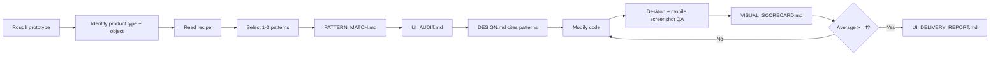

# Codex UI Designer Kit

Codex UI Designer Kit helps Codex turn rough but working prototypes into product-grade UI.

The kit is no longer just a screenshot/reference/checklist library. The current workflow is:

```text
recipe -> pattern match -> audit -> design -> code changes -> screenshot QA -> human visual score -> delivery report
```

Codex must select concrete React / Tailwind / shadcn-oriented patterns before implementation, so the final UI can imitate proven page skeletons instead of relying on abstract design advice.

## Problem

Codex can quickly build tools, dashboards, demos, and internal apps, but the first version often looks like a functional prototype:

- unclear hierarchy,
- weak navigation,
- oversized hero sections for tools,
- inconsistent cards/tables/forms,
- missing loading/empty/error/disabled states,
- broken mobile layout,
- no screenshot QA,
- no risk controls for customer data or external actions,
- no concrete code pattern to imitate.

This kit turns those recurring problems into a repeatable, pattern-first workflow.

## Suitable Scenarios

- SaaS dashboards and admin tools.
- CRM, customer operations, WeCom/企微 workflows, support or sales tools.
- AI workbenches, prompt tools, agent UIs.
- Data dashboards and BI-style reports.
- Mobile notes/task apps and app-style Web tools.
- Settings/forms, account configuration, permissions, API keys and webhooks.
- State coverage for loading, empty, error, disabled, hover, selected and review-required flows.

## Not Suitable For

- Copying another company's brand assets or proprietary design.
- Capturing private dashboards, logged-in pages, customer data, or secrets.
- Replacing product thinking with visual decoration only.
- High-risk customer messaging, exports, writebacks, or permission changes without human review.
- Using React Bits or other micro-interaction libraries as the main skeleton for CRM, dashboards or internal tools.

## New Workflow



## Project Structure

```text
.
  AGENTS.md
  PROJECT_LOG.md
  SKILL.md
  README.md
  benchmarks/
  checklists/
  examples/
  patterns/
    registry.json
    app-shell/
    data-table/
    dashboard/
    crm/
    ai-workbench/
    mobile-app/
    states/
    settings/
    micro-interactions/
  recipes/
  references/
  samples/
  scripts/
  templates/
```

## Quick Start

1. Read the skill workflow:

   ```powershell
   Get-Content -Encoding utf8 -Raw .\SKILL.md
   ```

2. Identify product type and main business object.

3. Read the matching recipe:

   - `recipes/saas-dashboard.md`
   - `recipes/crm-customer-ops.md`
   - `recipes/ai-workbench.md`
   - `recipes/data-dashboard.md`
   - `recipes/mobile-notes-app.md`

4. Read `patterns/registry.json` and select 1-3 patterns.

5. Generate `PATTERN_MATCH.md` from:

   - `templates/PATTERN_MATCH.md`

6. Audit the rough prototype with:

   - `templates/UI_AUDIT.md`
   - `checklists/ui-audit-checklist.md`
   - `checklists/product-ui-risk-checklist.md`

7. Write a design plan with:

   - `templates/DESIGN.md`

   `DESIGN.md` must cite specific selected patterns.

8. Modify the app.

9. Run screenshot QA:

   ```powershell
   node .\scripts\visual-audit.mjs --url http://localhost:3000 --name after
   ```

   Or for a static file:

   ```powershell
   node .\scripts\visual-audit.mjs --file .\examples\ugly-saas-dashboard\improved.html --name after --out .\examples\ugly-saas-dashboard\.design
   ```

10. Fill the human visual scorecard:

    - `templates/VISUAL_SCORECARD.md`

    Average score below 4 means the UI is not ready for delivery.

11. Generate before/after and delivery reports when applicable:

    ```powershell
    node .\scripts\compare-before-after.mjs --out .\examples\ugly-saas-dashboard\.design
    node .\scripts\generate-ui-report.mjs --caseDir .\examples\ugly-saas-dashboard
    ```

## Pattern Library MVP

The first pattern batch includes:

| Pattern | Best For |
|---|---|
| `app-shell/shadcn-dashboard-shell` | SaaS dashboard, CRM, internal tools |
| `app-shell/vite-shadcn-admin-shell` | Vite React admin shells |
| `data-table/faceted-filter-table` | Filterable tables, CRM lists, logs |
| `dashboard/tremor-kpi-chart-grid` | KPI dashboards and chart grids |
| `crm/customer-list-detail` | Customer list + detail + timeline |
| `ai-workbench/chat-history-runner` | AI chat, agent and prompt runners |
| `mobile-app/notes-workbench` | Mobile notes/tasks and lightweight app UI |
| `states/loading-empty-error-set` | State coverage across all product types |
| `settings/settings-form-page` | Settings, forms, permissions, API config |
| `micro-interactions/react-bits-empty-state` | Optional empty/running micro-interactions |

Each pattern contains:

- `pattern.md`
- `source-map.json`
- `code/README.md`

## Open Source References

The pattern library references public, license-clear sources and extracts structure rather than copying whole repositories:

- [shadcn/ui blocks](https://ui.shadcn.com/blocks)
- [shadcn-admin](https://github.com/satnaing/shadcn-admin)
- [next-shadcn-dashboard-starter](https://github.com/Kiranism/next-shadcn-dashboard-starter)
- [OpenStatus data-table-filters](https://github.com/openstatusHQ/data-table-filters)
- [Tremor](https://github.com/tremorlabs/tremor)
- [Origin UI](https://github.com/shadcn/originui)
- [React Bits](https://reactbits.dev/)

React Bits is treated as a micro-interaction reference only. Its repository license is MIT + Commons Clause, so copying or redistributing components requires extra review.

## Sample Quality

The original sample library remains useful, but it is no longer the only source of truth.

- `samples/analysis/*.md` has been repaired to UTF-8 Chinese.
- `samples/SAMPLE_QUALITY_REPORT.md` classifies samples as `strong-reference`, `visual-only`, `weak-sample`, or `code-backed`.
- `weak-sample` entries should not drive design decisions.
- `visual-only` entries can inform visual rhythm but not code structure.
- `code-backed` entries should be mapped to `patterns/`.

## Project Log

See `PROJECT_LOG.md` for the evolution from the original sample-driven idea, through `docs/optimization-roadmap.md`, to the current pattern-first workflow and GitHub publication notes.

## Running Screenshot QA

`scripts/visual-audit.mjs` is the mechanical QA tool.

It checks:

- blank/loading-page risk,
- horizontal scroll,
- text overflow candidates,
- small button candidates,
- large fixed overlay candidates,
- desktop and mobile screenshots.

Output:

```text
.design/
  screenshots/
    after-desktop.png
    after-mobile.png
  UI_QA_REPORT.md
  after-qa.json
```

The tool uses a temporary Chrome profile. It does not read your logged-in browser profile.

Mechanical QA is not enough. You must also fill `VISUAL_SCORECARD.md`.

## Data Safety And Human Review

This kit is optimistic about automation, but not blind.

Human review is required for:

- customer data display, export, or writeback,
- WeCom/企微, email, SMS, webhook, or bulk-send actions,
- permission changes and public sharing,
- deleting, merging, or batch-modifying records,
- API keys, tokens, secrets, internal links,
- external-facing copy, dates, links, recipients, and downloadable files.

When in doubt, stop before the external side effect and ask for confirmation.

## Current Status

- Stage 1 sample library: repaired and quality-ranked.
- Stage 2 structured references: retained.
- Stage 3 checklists: retained.
- Stage 4 pattern library MVP: complete.
- Stage 5 recipes: complete.
- Stage 6 pattern-first skill workflow: complete.
- Stage 7 screenshot QA MVP: retained.
- Stage 8 human visual scorecard: added.
- Stage 9 benchmark rules: added.

## Future Enhancements

- Add runnable benchmark projects for CRM, AI workbench, data dashboard, mobile notes and settings.
- Add component-level visual diff.
- Add token extraction for color, font size, spacing and radius consistency.
- Add framework adapters for Next.js, Vite, React, Vue and Svelte.
- Add richer accessibility checks.
