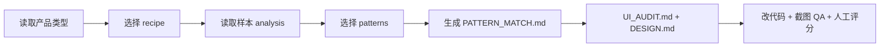

# Codex UI Designer Kit 样本库

采集日期：2026-06-23
修复日期：2026-06-25
用途：为 Codex UI Designer Kit 提供公开、可复核的 UI 参考样本，用于抽取产品级界面规则、pattern 选择依据和视觉 QA 对照。

## 样本范围

- 样本总数：60
- 截图总数：90
- 分类数量：7
- metadata：7 个 JSON 文件
- analysis：7 个 Markdown 文件，已修复 UTF-8 乱码

| 分类 | 样本数 | 截图数 | metadata | analysis |
|---|---:|---:|---|---|
| SaaS / 后台系统 | 12 | 12 | samples/metadata/saas-dashboard.json | samples/analysis/saas-dashboard-notes.md |
| CRM / 客户运营 | 10 | 10 | samples/metadata/crm-customer-ops.json | samples/analysis/crm-customer-ops-notes.md |
| AI 工作台 | 10 | 20 | samples/metadata/ai-workbench.json | samples/analysis/ai-workbench-notes.md |
| 数据看板 | 8 | 8 | samples/metadata/data-dashboard.json | samples/analysis/data-dashboard-notes.md |
| H5 / 移动 Web | 8 | 16 | samples/metadata/h5-mobile-web.json | samples/analysis/h5-mobile-web-notes.md |
| 小程序式模式 | 6 | 12 | samples/metadata/mini-program-patterns.json | samples/analysis/mini-program-patterns-notes.md |
| App 风格 Web UI | 6 | 12 | samples/metadata/app-style-web-ui.json | samples/analysis/app-style-web-ui-notes.md |

## 目录结构

```text
samples/
  collection-plan.md
  SAMPLE_QUALITY_REPORT.md
  raw-screenshots/
    saas-dashboard/
    crm-customer-ops/
    ai-workbench/
    data-dashboard/
    h5-mobile-web/
    mini-program-patterns/
    app-style-web-ui/
  metadata/
    saas-dashboard.json
    crm-customer-ops.json
    ai-workbench.json
    data-dashboard.json
    h5-mobile-web.json
    mini-program-patterns.json
    app-style-web-ui.json
  analysis/
    saas-dashboard-notes.md
    crm-customer-ops-notes.md
    ai-workbench-notes.md
    data-dashboard-notes.md
    h5-mobile-web-notes.md
    mini-program-patterns-notes.md
    app-style-web-ui-notes.md
```

## 样本质量层级

- `strong-reference`：值得继续作为高质量 UI 参考，截图可读、结构明确、业务对象清楚。
- `visual-only`：只能作为视觉、排版、密度或响应式参考，不应直接约束代码骨架。
- `weak-sample`：加载失败、登录/安全验证、about:blank、信息不足或营销页误判为后台，应降权。
- `code-backed`：可匹配公开代码范式，例如 shadcn/ui blocks、OpenStatus data-table、Tremor、Origin UI 或自建 pattern。

完整分层见 `samples/SAMPLE_QUALITY_REPORT.md`。

## 使用原则

1. 样本库负责提供真实产品视觉和信息架构线索，但不直接替代代码范式。
2. 改造项目时必须先选 recipe，再从 `patterns/registry.json` 选择 1-3 个 pattern。
3. 对后台、CRM、数据看板、AI 工作台，优先使用 pattern，而不是只模仿截图。
4. 不复制品牌资产、logo、专有插画、客户数据、内部链接、账号或密钥。
5. 涉及客户数据、权限、群发、导出、写回、外链、删除、密钥时必须人工确认。

## 推荐使用链路


