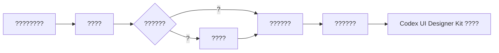

# Codex UI Designer Kit ???

?????2026-06-23

?????????? Web / SaaS / ???????? UI ????? Codex ???????????????? UI??????????????????????????????????????????????????????

## ????

- ?????60
- ?????90
- ?????60
- ?????30
- ??????7 ? JSON
- ?????7 ? Markdown

| ?? | ??? | ??? | ??? | ???? |
|---|---:|---:|---|---|
| SaaS / ???? | 12 | 12 | samples/metadata/saas-dashboard.json | samples/analysis/saas-dashboard-notes.md |
| CRM / ???? | 10 | 10 | samples/metadata/crm-customer-ops.json | samples/analysis/crm-customer-ops-notes.md |
| AI ??? | 10 | 20 | samples/metadata/ai-workbench.json | samples/analysis/ai-workbench-notes.md |
| ???? | 8 | 8 | samples/metadata/data-dashboard.json | samples/analysis/data-dashboard-notes.md |
| H5 / ?? Web | 8 | 16 | samples/metadata/h5-mobile-web.json | samples/analysis/h5-mobile-web-notes.md |
| ?????? | 6 | 12 | samples/metadata/mini-program-patterns.json | samples/analysis/mini-program-patterns-notes.md |
| App ?? Web UI | 6 | 12 | samples/metadata/app-style-web-ui.json | samples/analysis/app-style-web-ui-notes.md |

## ????

```text
samples/
  collection-plan.md
  raw-screenshots/
    saas-dashboard/
    crm-customer-ops/
    ai-workbench/
    data-dashboard/
    h5-mobile-web/
    mini-program-patterns/
    app-style-web-ui/
  metadata/
    saas-dashboard.json
    crm-customer-ops.json
    ai-workbench.json
    data-dashboard.json
    h5-mobile-web.json
    mini-program-patterns.json
    app-style-web-ui.json
  analysis/
    saas-dashboard-notes.md
    crm-customer-ops-notes.md
    ai-workbench-notes.md
    data-dashboard-notes.md
    h5-mobile-web-notes.md
    mini-program-patterns-notes.md
    app-style-web-ui-notes.md
```

## ????



## ??? UI Designer Kit ?????

- ?? / SaaS???????????????????????????????
- CRM / ????????????????????????????????????????
- AI ???????? empty?running?error?needs-review?accepted ?????????????????????
- ????????? KPI ?????????????????????
- H5 / ?? Web??????????????CTA ???????????????
- ??????????? -> ?? -> ?? -> ??/??????????????
- App ?? Web?????? shell????????????????????

## ???????

- ????????????????????????
- ?????????????????????????????????????????????? `samples/collection-plan.md`?
- ????????? UI ???????????logo???????????
- ??????? skill / checklist ?????????????????????????????????????/??????????????

## ?????

1. ? 7 ???????? `references/ui-patterns.md`?
2. ??????? `checklists/prototype-to-product-ui.md`?
3. ? Codex ?? UI ?????????????????????????????
4. ???????????????hover?selected?empty?error?loading?disabled?
